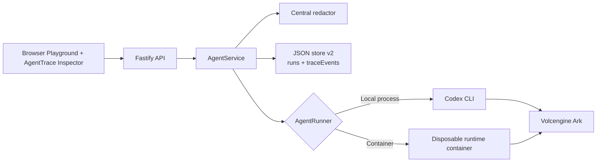

# AgentTrace

AgentTrace is a TikTok Tech Jam Track 1 Glass Box extension built on top of the Volc Agent Launchpad starter kit. It adds backend trace recording, audit-friendly run history, runtime step correlation, and secret redaction so judges can inspect what an agent actually did while a task was running.

## Selected Track

`Glass Box: trace and audit`

This project intentionally does not implement Kill Switch policy enforcement in v1. The focus is traceability, failure diagnosis, and safe demo output.

## What AgentTrace Adds

- Correlated run timeline stored in the backend
- Run lifecycle events from queue to terminal state
- Runtime steps for commands, file changes, tool calls, searches, messages, usage, and errors
- Secret redaction for stored prompts, messages, outputs, errors, and trace details
- Responsive right-side inspector with run history, timeline, durations, failed steps, usage, and redaction counts
- Automatic database migration from starter kit schema version 1 to version 2

## Architecture

See [docs/ARCHITECTURE.md](docs/ARCHITECTURE.md) for the full component view.



Ark credentials stay outside persisted trace data. AgentTrace stores only redacted user-visible details and minimal structured runtime metadata.

## Local Setup

### Requirements

- Node.js 22+
- npm 10+
- Either local Codex CLI or a container engine for the starter runtime path
- Ark API key and model ID for real runs

### Install and configure

```bash
npm install
cp .env.example .env
```

For local development, use paths like:

```dotenv
APP_DATA_DIR=.data
AGENT_WORKSPACE_ROOT=workspaces
CODEX_HOME=codex-home
RUNTIME_PROVIDER=local-process
ARK_API_KEY=your-private-key
ARK_MODEL=ep-your-model
```

### Start the app

```bash
npm run dev
```

- Web UI: [http://localhost:5173](http://localhost:5173)
- API: [http://localhost:3000](http://localhost:3000)

### Validate

```bash
npm run check
```

## Demo Script

Use these exact steps for the hackathon demo:

1. Create an Agent and open the Playground.
2. Run a successful task such as: `Create a tiny TypeScript CLI and run its test.`
3. Open the AgentTrace inspector and show the run summary, durations, steps, and token usage.
4. Run a failing task such as: `Run cat missing-file-for-demo.txt and explain the failure.`
5. Open the failing run and identify the exact failed step, its exit status, and the diagnostic detail.
6. Include a mock secret in a prompt or runtime output and show that AgentTrace stores `[REDACTED]` instead of the raw value.

## Acceptance Notes

- The middleware executes in the backend, not as a mock UI
- Both success and failure cases are visible in the trace
- Stored prompts and runtime details are redacted before persistence
- Existing agents, messages, and runs survive schema migration
- Deleting an Agent also deletes its trace records

## Current Limitations

- The product is still single-user and uses a shared access token, not real identity
- Policy enforcement and kill-switch behavior are out of scope for this track
- Container instrumentation is implemented, but Docker or Podman still needs to be installed locally for that runtime mode
- Final Ark-backed rehearsal still requires real private credentials in `.env`

## References

- [Architecture](docs/ARCHITECTURE.md)
- [Hackathon extension guide](docs/HACKATHON_EXTENSION_GUIDE.md)
- [Local POC](docs/LOCAL_POC.md)
- [Deployment](docs/DEPLOYMENT.md)
- [Security policy](SECURITY.md)

## License

[MIT](LICENSE)
