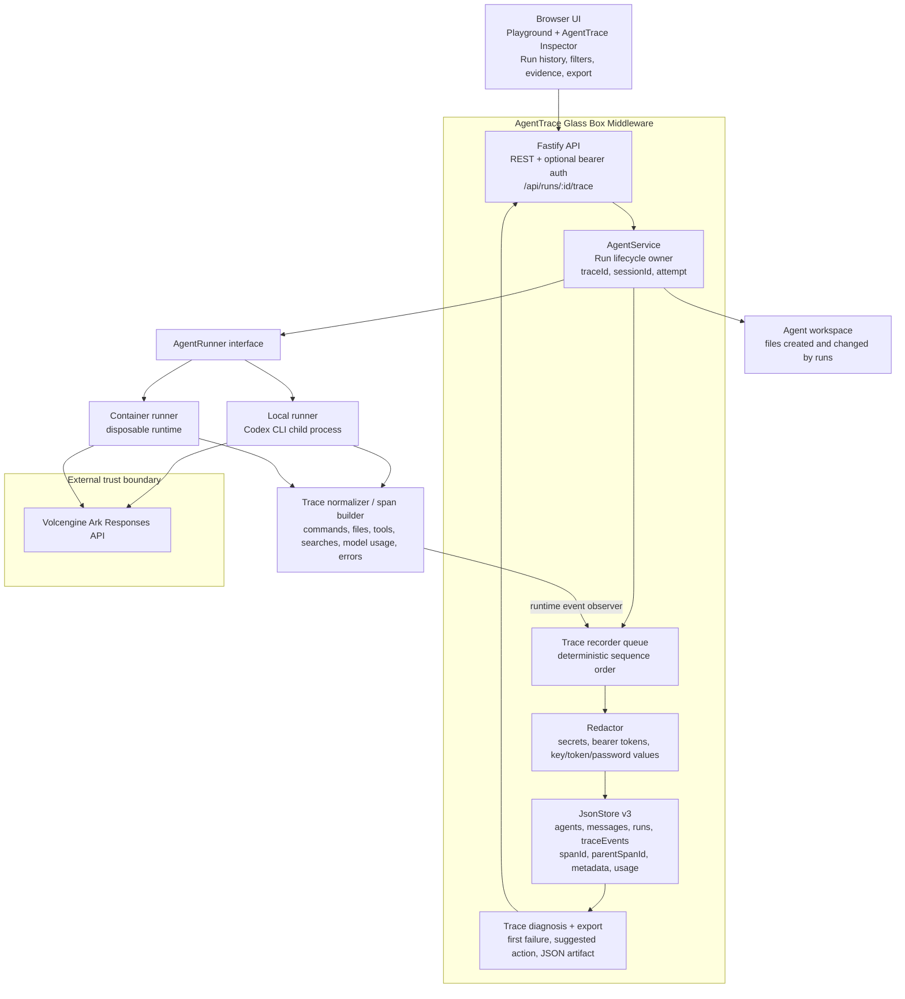

# AgentTrace One-Page Architecture Diagram

Use this diagram for the TikTok Tech Jam Track 1 Glass Box deliverable. It shows the middleware boundary, trace data flow, persistent audit store, runner instrumentation, and the external Ark trust boundary.

## What The Diagram Proves

- AgentTrace is backend middleware, not a UI-only log screen.
- Runs are represented as correlated traces with `traceId`, `spanId`, `parentSpanId`, session, attempt, and agent version.
- Runtime events are normalized before storage.
- Prompts, outputs, errors, and event details pass through redaction before persistence or display.
- The inspector reads the audit trail through the API and can identify a failed step quickly.
- Ark remains outside the local trust boundary; credentials are never stored in trace data.
