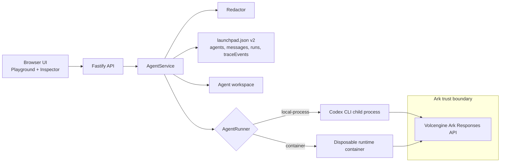

# AgentTrace Architecture

AgentTrace keeps the starter kit flow intact, then inserts trace capture and redaction into the backend path that already owns run execution.

## One-page view

## Flow

1. The browser sends a prompt to the Fastify API.
2. `AgentService` creates a queued run, stores the redacted prompt, and appends the first lifecycle trace event.
3. The runner executes Codex and streams JSON events.
4. Runtime events are normalized into a small `TraceEvent` model and passed back through the observer.
5. `AgentService` redacts safe detail fields again before persisting them into `traceEvents`.
6. The browser polls the run and trace endpoints until the run reaches a terminal state.
7. The inspector renders ordered steps, durations, failed commands, usage, and redaction counts.

## Main Components

### AgentService

- Owns run lifecycle state
- Ensures one active run per Agent
- Records lifecycle trace events
- Closes unfinished trace steps on restart, cancellation, timeout, or failure

### Redactor

- Replaces configured secrets
- Replaces bearer tokens and common API-key formats
- Redacts values attached to key, token, secret, and password fields
- Prevents raw prompt, output, and error strings from reaching disk

### JsonStore v2

- Migrates v1 starter data automatically
- Persists `traceEvents` alongside existing agent, message, and run records
- Serializes writes so rapid runtime events keep deterministic ordering

### Runners

- `CodexRunner` covers local process execution
- `ContainerCodexRunner` covers disposable local runtime containers
- Both emit the same normalized runtime event model

## Data Model

Each trace record stores:

- run and agent identifiers
- deterministic sequence number
- source, kind, and status
- label
- item correlation id when available
- started and completed timestamps
- duration
- minimal safe detail
- usage
- whether redaction was applied

The store intentionally does not persist raw reasoning or unrestricted runtime payloads.
